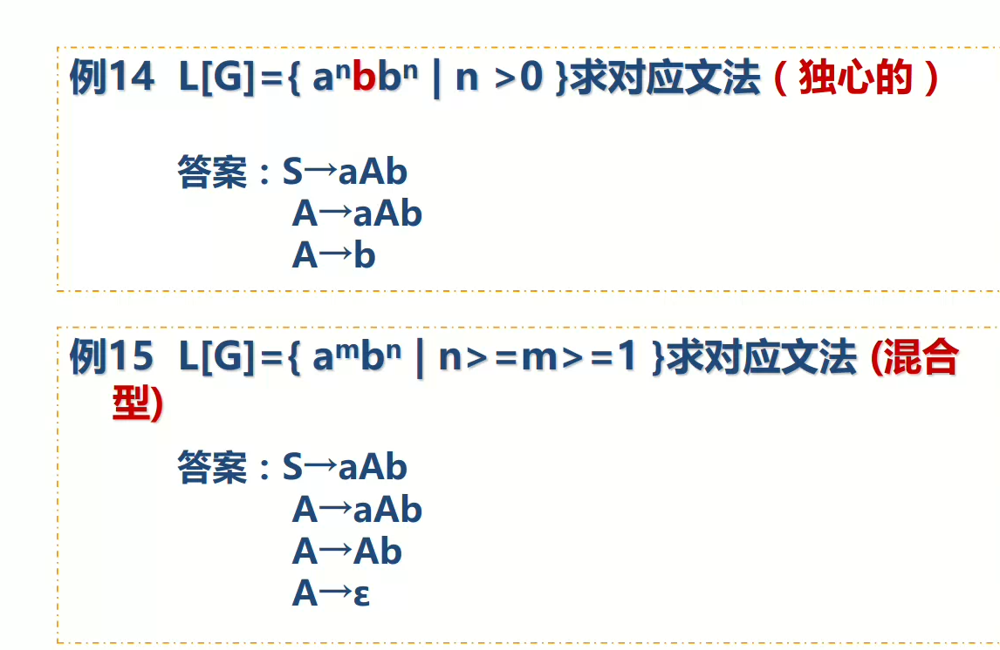
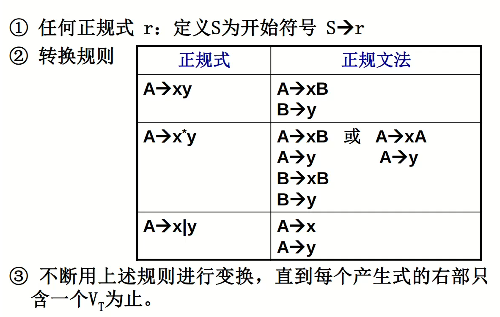
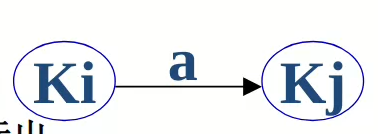
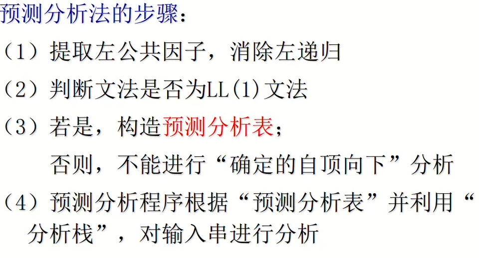
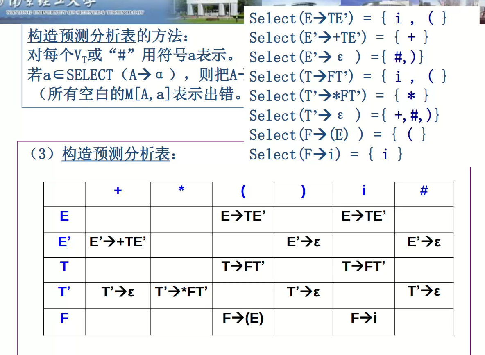
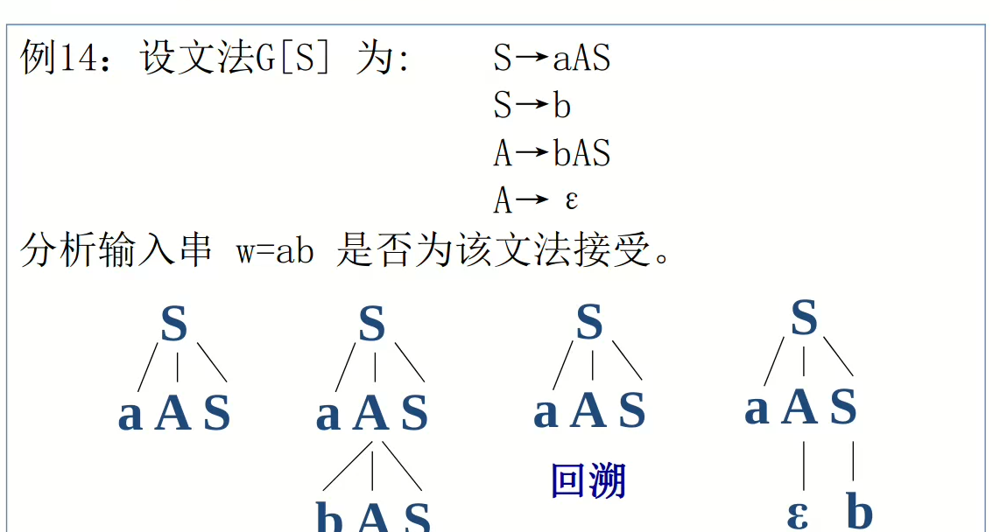

# 编译原理
# 第一章 编译程序概述
## 编译程序、编译器Compiler
**将高级语言的源程序翻译为低级语言（机器语言）的目标程序**。
分为一趟、多趟编译。
## 高级语言的编译过程
##### 高级语言转换为低级语言的过程

##### 编译过程

###### 词法分析
**识别单词流**，得到单词，如标识符、保留字、字符、常数等

###### 语法分析
**识别出单词序列中的短语**，如表达式、语句等，确认整个输入串是否构成一个正确的语法短语

递归定义表达式：标识符和常数是表达式；表达式+-*/表达式是表达式；
递归定义语句：标识符 := 表达式是语句；While 表达式 do 语句是语句；if 表达式 then 语句是语句。
###### 语义分析
**审查语义错误**，如类型、数值错误等。如：数组下标不能用double类型，double+int需要转换为double+double。
- 语义：按照语法规则组成的语法成分的含义。分为静态语义（编译时即可确定）和动态语义（运行时才能确定）
###### 中间代码生成
生成四元组（运算符，运算对象1，运算对象2，结果），将源程序转换为简单的记号。

###### 中间代码优化
优化冗余代码，使其更加高效（时间空间）。

###### 生成目标代码
将**中间代码转换为绝对指令代码或可重定位的机器指令代码/汇编指令代码**
注意，这种变换是基于语义的等价变换，而不是结构等价变换
###### 表格管理
保存源程序的各种信息
###### 出错处理
对不符合**语法规则(单词组成、语句组成)、语义规则(类型等)**的报出出错原因和位置。
## 不同编译阶段
##### 前端
**主要依赖于源语言而与目标机器无关的编译阶段**。
如：词法分析、语法分析、语义分析、中间代码生成、部分代码优化、与前端有关的出错处理工作和表格管理。
##### 后端
**依赖于目标机而一般不依赖于源语言，只与中间代码有关的编译阶段。**
如：目标代码生成，以及相关出错处理和表格处理。
##### 遍（趟）
对源程序或其等价的中间语言程序从头到尾扫视并完成规定任务的过程。一次完成1/多阶段任务。
多遍编译：占内存少，逻辑结构清晰，耗时长
一遍编译：占内存多，逻辑结构不清晰，耗时短
## 解释程序
可移植性强，但效率慢，占用空间大。
解释程序和编译程序的本质区别：**是否生成目标代码**
## 课后习题答案
https://blog.csdn.net/sun80760/article/details/129290633
# 第二章 文法和语言
程序设计语言也需要语法和语义的定义。
- 语法：组成合法符号序列的方法。如a := b + c是合法的，而a := b + 不合法。一般用**上下文无关文法**来进行分析。
- 语义：合法符号序列的含义。例如a := b + c中，若b是bool值，c是int值，则含义不符，报错。然而，上下文无关文法不能检测这种错误，需要**额外的语义分析**。
- 语用：表示在各个记号所出现的行为中，它们的来源、使用和影响。
## 形式语言
**只关心语法的语言**。语言的所有规则只以什么符号串能出现的方式来陈述。
## 文法
描述词法、语法规则的工具。**用一组规则严格定义句子的结构**，即对含有“无穷句子”的语言进行“有穷的表示
### 文法组成
#### 符号和符号串
##### 字母表
字母表$\Sigma$所有元素的**非空有穷**集合（**非终结符**）。例如汉语中的汉字、数字、标点符号等。
##### 符号
字母表中的元素。
##### 符号串
字母表中符号组成的任何**有穷有序序列**。
1. 空符号串$\epsilon$
2. 有穷有序序列
如$Sigma=\{0,1\}$，则符号串集合为$\{\epsilon, 0, 1, 01, 10, 00 ,11 ,...\}$
###### 符号串长度
符号的个数。$|0101|=4，|\epsilon| = 0$
###### 符号串头、尾、固有头、固有尾
符号串$Z=xy$，则$x$是$Z$的头，$y$是$Z$的尾。

###### 符号串拼接
$xy$拼接，即把$y$的内容接在$x$后面
$x=01,y=abc$,则$xy=01abc$
$x\epsilon=\epsilon x = x$
###### 符号串方幂
符号串$x$自身连接$n$次，得到$x^n$。
如$x=01$，$x^0=\epsilon,x^3 = 010101$
###### 符号串集合
一个集合A，内容是字母表$\Sigma$的所有符号串集合。

###### 符号串集合的乘积

###### 集合的闭包
一个符号串$V$，闭包$V*$为所有有穷符号串集合，包括$\epsilon$，正闭包$V^+$要去除$\epsilon$

#### 文法的组成规则
##### 产生式
$\alpha → \beta$，其中$\alpha \in V^+,\beta \in V*$。读作$\alpha$（左部）定义为$\beta$（右部）。
##### 定义
文法G由一个四元组定义：($V_N$,$V_T$,P,S)。
###### 四元组解释
- $V_N$：非终结符集
- $V_T$：终结符集
- $P$：产生式集
- $S$：开始符号，**必须至少在$P$的某一个产生式的左部出现**。
其中，$V=V_N ∪ V_T$，称为文法G的字母表
###### 简写

##### 产生式的推导
###### 直接推导

即一个符号串A通过文法的某个产生式P替换了某个符号，得到了符号串B，称为A直接推导到B。
###### (间接)推导

即一个符号串A通过多步推导到B。+表示$A \neq B$，而*表示可以存在$A=B$
##### 句型
如果一个符号串是由开始符号S推导出来的($→^*$)，就称为这个文法的句型。
##### 句子
仅由$V_T$，即终结符组成的句型。$S→^*x,x\in V_t$
##### 语言
一个语言L(G)，就是由文法G的所有句子组成的集合。
###### 文法的等价
若两个文法的语言$L(G_1)=L(G_2)$，则称两文法$G_1,G_2$等价。
### 通过文法得到语言
1. 
2. 
### 通过语言得到文法
1. 
2. 
3. 
4. 
### 文法的类型
#### 0型文法PSG
每个产生式$\alpha → \beta$都存在：$\alpha$至少包含一个非终结符，和其他任何符号；$\beta$由任何符号组成。实际上对产生式没有任何限制。是一个图灵机，递归可枚举。

#### 1型文法CSG
上下文有关文法

#### 2型文法CFG
$\alpha$是一个非终结符，$\beta$由任何符号组成，**称为上下文无关文法**。
#### 3型文法RG
正规文法

## 上下文无关文法及其语法树
上下文无关文法：2型CFG文法，每个产生式$\alpha → \beta$都满足：$\alpha$是一个非终结符，$\beta$由任何符号组成。
### 语法树
用于描述上下文无关文法**推导过程**的直观表示。

#### 定义

#### 最右推导

#### 二义文法
如果一个文法对于某个句子的语法树有不同的两个(有两个不同的最左/右推导)，则称为二义文法。如果这个文法的语言中每个句子都是二义的，则说这个文法是先天二义的。
解决二义性：可能能够通过加入优先顺序和结合律解决，**但不一定会成功**。
## 句型分析
句型分析就是判断一个句型是否能够由某个文法推导，是推导的构造过程。总是从最左的符号开始读入。
### 句型分析分类
##### 自上而下分析
从文法的开始符号出发，反复使用各种产生式，寻找与输入符号匹配的推导

##### 自下而上分析
从输入符号串开始，逐步进行归约，直至归约到文法的开始符号

### 句柄
如何知道用那个产生式规约？引入句柄
##### 短语
一个句型中，某个子符号串$\beta$，是A通过很多步产生式产生出来的，即最后可以规约为A，则称$\beta$为句型相对于A的短语。短语就是**一颗语法树上的每一颗子树**

##### 直接短语
$\beta$由$A$直接推导得出，即子符号串（短语）$\beta$可以直接规约到A，称为直接短语。****

##### 句柄
一个句型的**最左直接短语**称为句柄。即最左侧的可以用某个产生式直接规约的子符号串（短语）。
#### 举例

## 文法要求

### 举例

## 例题

# 第三章 词法分析
词法分析是为了分析出字符流中的每个词法合法的“单词”，并输出给语法分析软件。
##### 词法分析的任务
主要任务是读出单词

## 词法分析工作的设计
设计过程中，可以使用：
1. 当做一个**独立程序**，将整个字符流全部转换为单词流后输出二元组文件给语法分析如那件。
2. 当做一个**子程序**，每当语法分析程序需要“下一个单词”时才读出下一个单词。
##### 词法分析中常用的单词

##### 词法分析程序的输出:二元组
使用二元式进行输出：（单词种类，单词输出的值），例如（2，'5'），表示类型是常数（编号为2，值为5）；(3,'if')，表示类型是关键字，值为if。
对于标识符这种不固定的类型（可能是x,y,z,shijian,time,...），**需要指向符号表表项的指针**，如(1，指向x变量的指针)，其中1表示标识符的编号。
##### 词法分析设计为独立阶段的原因
1. 编译程序结构简洁有条理，源文件的复杂性会导致单词复杂需要单独的阶段来处理
2. 效率高
3. 增强可移植性
## 单词描述工具
### 正规文法
正规文法即3型文法，即所有产生式中只存在$A→aB|a$（右线性）或$A→Ba|a$即右部只存在一个非终结符$V_T$
例如：
### 正规式
用来表示正规集L

##### 递归定义
1. 对于正规集$\{\Epsilon\}和空集$，$\Epsilon$是正规式
2. 对于字母表上的任何字母a是正规式，{a}是一个正规集
3. 对于两个正规式$e_1,e_2$，正规集为$L(e_1)、L(e_2)$，他们的闭包*、连接、或、(e)都是正规式，正规集表示为：
   1. 闭包$e_1^*$的正规集为${L(e_1)}^*$
   2. 连接$e_1·e_2$的正规集为$L(e_1)L(e_2)$
   3. 或$e_1|e_2$的正规集为$L(e_1)∪L(e_2)$
   4. 括号$(e_1)$的正规集为$L(e_1)$
4. 仅由**有限次**上述步骤组成的式子才是正规式。

##### 两个正规式等价
对于两个正规式$e_1$和$e_2$，如果正规集$L(e_1)$和$L(e_2)$相同，则称他俩等价，$e_1=e_2$
##### 正规式的代数运算

### 正规式和正规文法的转换
对于任意一个正规式（正规文法），一定存在一个生成（定义）同一个语言的正规文法（正规式）。
##### 正规文法→正规式

反复使用上述规则，直到最后只剩下一个开始符号。
例：
##### 正规式→正规文法

例：
## 有穷自动机
FA，Finite AutoMata，用来自动分析正规集的工具。
### 确定有穷自动机DFA
##### 定义

其中，$f(k_i,a)=k_j$表示在状态$k_i \in K$遇到输入符号$a \in \Sigma$后，会转换到状态$k_j \in K$。
对于DFA确定有穷状态机，**f转换函数是单值函数，即没有不确定性**。
对于一个空符号串，定义状态不变。
#### 描述
##### 状态(转换)图

1. 用圆圈表示不同状态$k \in K$
2. 用箭头和符号表示读入某个字母符号后转换状态
3. 初态S用双箭头或-表示
4. 终态Z用双圆圈或+表示
##### 状态转换矩阵

默认第一行是初态，终态在矩阵右侧用1标识。
#### 接受符号串（句子）
一个句子$t \in \Sigma^*$,从初态节点开始，$f(S,t_1t_2t_3...)=f(f(f(S,t_1)t_2)t_3)...=P$，**P是终态**，则可以接受。能够被DFA M接受的句子全体记作$L(M)$
### 不确定有穷自动机NFA
#### 定义
五元组，其中**f转换函数并不是单值函数，且初态不唯一**
#### 接受符号串
如果从初态节点到终态节点有一条通路，则通路上的标记组成的符号串可被接受。**如果有一条路径全部由$\epsilon$组成，或某个节点既是初态也是终态，则空符号串可被接受。**
所有能被接受句子的集合称为$L(M')$，**对于任意NFA，一定存在一个DFA使得$L(M')=L(M)$。**
### NFA转换为DFA
#### 子集法
思想：DFA一个状态对应NFA的一组状态，**DFA需要记录NFA读入某个符号后可能前往的所有状态**
##### 基本运算
###### e-闭包e-Closure

###### 状态集合I的a弧转换

##### 运算过程

###### 构造DFA的S状态集合(构造NFA的K的子集)

从初态$K_0$开始，对每个未被标记的集合,使用每一个可读入符号计算$\Epsilon-Closure(Move(T,a))$，**看从某个未标记状态就开始，是否能读入某个符号而进入一个新的状态集**。

###### 将未化简的DFA状态图画出来
1. 每一个状态$S_i$都是上一步构造出的子集，包含了NFA的多个状态
2. 根据闭包来判断读入某个字符后转换的状态
3. 初态是$K_0$所在的第一个集合
4. 终态是$K$终态所在的集合
###### 化简DFA(最小化DFA)
1. 没有多余状态：**从开始符号开始到达不了的状态，或到达不了终态的状态**
2. 没有两个等价状态：
   1. 一致性：A、B同是终态或非终态
   2. 蔓延性：从A出发读入a到达的状态和从B出发读入a到达的状态等价。
   需要合并等价状态。
   分割法合并等价状态：
      1. 首先将所有状态分为$P=\[K_1=\{所有终结状态\}、K_2=\{所有非终结状态\}\]$
      2. 对于每个状态集合$K_1和K_2$中的状态，读入不同符号后，不同的状态$T_i$进入了不同状态集合$K_j$，就说明不等价，将所有不等价状态分开，$K_1、K_2$中的状态分裂为两个新的状态集合。
      3. 重复2中步骤，直到每个状态集合都不能再分裂，则状态集合中存在的两个以上状态都是等价状态，直接合并为一个状态即可。
## 正规式和有穷自动机的转换
对于$\Sigma$字母表上的正规式R和自动机NFA M，能相互转换，使得L(R)=L(M)
### FA→正规式
思想：将NFA中的弧用正规式表示。
1. 新增两个状态结点$x,y$，使得x用$\Epsilon$弧连接所有初态结点；所有终态结点用$\Epsilon$弧连接y。**将初态和终态结点固定为一个**
2. 用正规式替换弧和结点，直到只剩下$x,y$两节点，要求：
### 正规式→FA
对正规式**分解出的子表达式进行构造NFA结点**；分解的顺序或方法不同，NFA不同，**但化简后的DFA一定相同**

## 正规文法和有穷自动机的转换
### 正规文法→FA

1. 对于$A→Ba$（左线性），则先B再a，引B到A的弧
2. 对于$A→aB$（右现行），则先a再B，引A到B的弧
#### FA→正规文法

# 第四章 自顶向下分析
语法分析作用：**查看给定的单词符号序列是否是文法的正确程序**。
## 确定的自顶向下分析方法
从文法的开始符号出发，**根据需要分析的输入符号唯一确定使用哪个产生式进行推导**，并画出语法树。
### 确定自顶向下分析条件
一个上下文无关文法，对于所有有空产生式的非终结符$V_N$：
1. 对于$V_N$的多个**非空产生式，右部的首符号集不相交**。即对于左部相同的两个产生式$T→A$、$T→B$，要求$First(A) ∩ First(B) = ∅$
2. 推导过程中，每个$V_N$产生式中，紧跟该$V_N$**可能出现**的$V_T$集合也不相交。
### First集合
对于每个产生式右部计算First

例子：
一个$First(\alpha)$，如果$\alpha$是以终结符$a$开始，则$First(\alpha)=a$；若以非终结符$A$开始，则$First(\alpha) = First(A)$，计算$First(A)$需要去找其他左部为$A$的产生式。若$A$可以推得$\Epsilon$，则$First(\alpha)$不仅要加入$First(A)$，还要∪A后的符号($V_T或First(V_N)$)。
### Follow集合
对所有非终结符计算Follow集合

即$Follow(A)=a，其中a为S推得的所有句型中，A非终结符后面紧跟的一个非终结符a，...Aa...$
##### 计算Follow集步骤
1. 遍历所有不冗余（能从S开始被推导到的）的产生式，看目标非终结符$B$后面有什么终结符$a$
2. 再寻找$B$后的非终结符A，$∪First(A)$。
3. 如果$A$可以推得$\Epsilon$，或$B$就是产生式的最后一个（$B$后为$\Epsilon$），则#也在Follow中
4. 若$T→...BA$，A是$\Epsilon$或能推导出$\Epsilon$，则$Follow(B)$还需要$∪Follow(T)$
### Select集合
对所有产生式计算Select集合。

### 确定自顶向下分析要求的LL(1)文法

LL1：Left Scan（从左向右扫描） Analyse from left（最左推导） 1 （向右看一个符号就知道用哪个产生式推导）
#### 判定LL（1）文法过程
##### 首先，列出能够推导出空符号串的非终结符列表
###### 扫描产生式
1. 对所有非终结符$V_N$列一个列表，都标记为“未定”
2. 删除所有右部存在非终结符$V_T$的产生式。**如果某个非终结符A作为左部的产生式全部被删除，则A不能推导出$\Epsilon$，设置为否**
3. **对于右部推得$\Epsilon$的产生式，删除后将对应左部B设置为是，并删除所有B的产生式**
###### 扫描右部的每一个非终结符
1. 若某个产生式右部的非终结符$V_N$被标记为是，即可以推得$\Epsilon$，则删除这个符号（用空替换）。**如果替换后右部为空（什么都没有了），则设置左部的非终结符C为是，删除C的所有产生式**。
2. 若某个产生式右部的非终结符$V_N$被标记为否，则删除该产生式。**若左部的非终结符D的所有产生式都被删除，则标记D为否**。
3. 重复1、2直到所有符号都被标记。
##### 计算First集合
计算**所有非终结符+所有右部符号串**的First集合。
##### 计算Follow集合

##### 计算Select集合

##### 判别
计算相同左部的产生式Select集合的交集，全为$∅$则是LL(1)文法。
### 非LL(1)文法转换为LL(1)文法
1. 无空产生式
2. 无左公因子：$A→\alpha\beta | \alpha \gamma = \alpha(\beta | \gamma)$
3. 无左递归：$A→A\beta 或 A→B\beta, B → A\alpha$
若满足1、2、3，则一定是LL(1)。若不满足2或3,则一定不是LL(1)。若仅不满足1，则需要判别。
##### 提取左公因子
###### 一般显式方法

思想：新增一个A'非终结符，将左公因子提取掉。
###### 隐含左公因子方法
提取隐含的左公因子：产生式右部以某个非终结符$V_N$开始的产生式，**用$V_N$作为左部的产生式替换，看是否存在左公因子**，存在则提取。
###### 可能存在不能在有限次步骤内完成提取的左公因子
##### 消除左递归
###### 直接左递归
$A→A\beta$

###### 间接左递归
$A→B\beta ,B → A\alpha$
1. 将间接左递归转换为直接左递归$A→A\alpha \beta$
2. 将直接左递归转换为右递归
###### 消除一切左递归

1. 将所有非终结符排序
2. 从第一个$V_N$开始，第一个不用遍历
3. 到第i个时与前面的i-1个相互判断，若存在$A_i$为左部的产生式右部开头为前面i-1个中的某个(j)非终结符，则需要替换。将这个产生式$A_i→A_j\alpha$中的$A_j$全部用$A_j$的产生式替换
4. 删除无用产生式

### 确定自顶向下分析法
#### 递归子程序法
为每个非终结符设置一个递归子程序，用于判断该终结符能够推出的串；如果有多个候选，则**按照LL(1)原则进行推导**。对文法要求较高，必须满足LL(1)。
#### 预测分析法
##### 组成
预测分析程序、先进后出栈、预测分析表
##### 步骤

##### 预测分析表
###### 介绍
与文法有关。是一个二维矩阵，表项为M(A,a)，A表示所有非终结符，a表示所有终结符和#。M(A,a)是一个产生式，**表示当使用非终结符A推导时，如果遇到a符号时应该使用哪个产生式进行推导**。如果该表项为空，则说明遇到了问题，转向出错程序。
###### 构造方法

1. 对于所有的$Select(A→a)={a,b,c...}$，M(A,a)=M(A,b)...=A→a
##### 栈和分析程序

由于是LL文法，需要最左推导，所以**使用产生式替换原栈中非终结符时，需要倒序入栈，最左侧的非终结符在栈顶**，和下一个符号进行匹配。
## 不确定自顶向下分析
也称为“带回溯的自顶向下分析”，由于不能唯一确定使用哪一个产生式进行推导，需要回溯。
### 引起回溯的原因
##### 由于左部相同的产生式的右部First集交集不为空

##### 由于左部相同VN的右部能推导出ε，且该VN的Follow集中含有其右部First集的元素

##### 由于存在左递归

# 第五章 自底向上优先分析
## 移进-规约分析
将一个符号串的终结符从左到右开始一个一个入栈（移进），一但出现某个句型的句柄则用相应产生式规约为某个非终结符。直到规约到开始符号S。
## 简单优先分析法
求出**所有符号（$V_N,V_T$）的优先关系（=、<、>）**，按照这些关系确定**句柄**。规范、准确、效率较低。应用不多。

### 确定优先关系
对于所有符号$V^*$，以从左往右为对比基准（即以XY为顺序的，只存在X=Y、X>Y或X<Y，而Y不能在左侧），扫描所有**产生式和生成的短语**:
1. 若有$A → ...XY...$，则$X=Y$。相邻符号相等。
2. 若有$A → ...XB...$，且$B →^+ Y...$，则$X<Y$，其中**Y可以继续推导直到遇到终结符**。即从左往右移进-规约时，X($V_T$或$V_N$)不能规约，而B能推导的**第一个符号**能规约为B，那么X的优先级小于B能推导出的第一个符号V，当出现X和V时，X的优先级更小，因为V能规约为B。
3. 若有$A → BD$，且$B →^+ ...X$，$D →^* Y...$，则$X>Y$,**其中XY可以继续推导**。即从左往右移进-规约时，B能推导出的最后一个符号$V_B$一定比D和D本身能推导出的第一个符号$D、V_D$要先规约，则B能推导出的最后一个符号优先级一定大于D，且大于D能推导的第一个符号。
- 所有句子都有开头和结尾的#。#是一种特殊的括号，有**$\# = \#、\#<V、V>\# $**，其中$V$是所有其他正常符号。**表明了#优先级最低**。

### 优先关系表
表行列都是所有符号，以行=、<、>列的方式填入符号。

### 分析方法
##### 简单优先文法
一个文法是简单优先文法，需要满足：
1. 优先关系表中每格只有一个优先关系；
2. 没有空产生式；
3. 任意两个产生式有不同右部。
##### 分析过程
一个待分析串$#a_1a_2a_3...#$，如果优先关系表中找不到关系，则不接受，错误。
1. 一个个入栈，直到遇到栈顶符号$a_j$>待入栈符号$a_{j+1}$。此时栈中优先级很高，是句柄的尾部，需要开始规约。
2. 从栈顶开始向栈底扫描，直到遇到$a_{i-1}<a_{i}$，此时$a_i$到栈顶优先级最高，是句柄的头部，可以规约。此时整个句柄所有元素的优先级都相同，而比句柄外的优先级都高。
右部中查找$a_i...a_j$，若存在则为句柄，直接规约。如果不存在则不接受，错误。

## 算符优先分析
只关注算符（终结符$$）
非规范规约。关键是寻找**最左素短语**，符号栈顶出现最左素短语就进行规约。有局限性，**可能使错误句子通过**，且对句子的要求高，基本只能分析表达式。
### 直观算符优先分析
一个计算中，同一优先级的运算（加减乘除等）一定先算前面的，称为左结合。直观算符优先分析就是人为设置各个算符的优先关系，对于相同优先关系的算符规定左/右结合。

### 算符优先文法
#### 算符文法
##### 算符文法条件
所有产生式都不存在$A→...BC...$，即**右部不存在任何两非终结符相邻**。
##### 算符文法性质
1. 所有产生式右部不存在两非终结符相邻
2. 如果Ab或bA($A \in V_N,b \in V_T$)出现在算符文法的句型$\alpha$中，则$\alpha$的所有短语中，**只要出现了b就一定出现A；但出现了A不一定出现b。**
#### 算符优先文法
##### 要求
1. 不存在空产生式
2. 优先关系表中，任何一对(a,b)之间只有=、>、<之间的**一种关系成立**，则为OPG算符优先文法。
##### 优先关系
**只考虑终结符**
###### 将$S→\# S' \#$引入
###### 计算集合
First/LastVT集合是对所有非终结符求集合
- 计算FirstVT集合：$FirstVT(B)=\{b|B→b...或Cb...\}$，即B能推的第一个终结符$b∪FirstVT(C)$
- 计算LastVT集合：$LastVT(B)=\{b|B→...b或...bC\}$，即B能推的最后一个终结符$b∪LastVT(C)$
###### 计算关系
- 计算=关系：**直接找产生式中有$A→...ab...$或$A→...aCb$**，则$a=b$。即忽略非终结符时，寻找两个终结符相邻。
- 计算<关系：找产生式中的**$A→...aB...$**，则$a<FirstVT(B)$。
- 计算>关系：找产生式中的**$A→...Ba...$**，则$LastVT(B)>a$。
###### 绘制出优先关系表
### 最左素短语
- 素短语：文法G[S]的句型中，一个短语至少包含一个终结符，且除自身外**不再包含素短语**。
- 最左素短语：句型最左边的素短语。
- 例如：$\#T+T*F+i\#$，短语有$T、T*F、i、T+T*F+i、T+T*F$，则素短语是$T*F$和$i$，最左素短语$T*F$。
- 规约栈中的最左素短语要满足：$N_ia_iN_{i+1}a_{i+1}...N_ja_j$，其中$a_{i-1}<a_i$，$a_i=a_{i+1}=a{i+2}=...=a{j}$，$a_j>a_{j+1}。即最左侧$a_i$的左侧非终结符(#)<$a_i$，最左素短语中的所有$a$全部=，最右侧$a_j$>$a_{j+1}
- **由于算符优先分析方法不关心句柄而只关心最左素短语，所以可能规约成功的句子实际上不是文法的句子**。
### 规约方法
算符优先文法主要是要寻找最左素短语。对于一个#...#的句子，判断能否由文法G(S)规约，则：
1. 从第一个#（自左向右）开始入栈。
2. 如果栈顶符号$a_i$<当前符号$a_{i+1}$，则移进；若栈顶符号$a_i$>当前符号$a_{i+1}，则在栈中寻找最左素短语的头和尾($a_{i-1}<a{i}-a_{j}>a{j+1}$，选取$a_i-a_j$)，用产生式替换。**这样仅仅构造了语法树的结构，忽略了具体的非终结符，并没有构造整个语法树**
3. 若中途有非终结符A，则跳过，只判断非终结符。但替换规约时，要根据算符优先文法的性质将非终结符一起规约。
4. 最后，**如果只剩下#B**，即一个左括号#和一个非终结符，则规约成功。否则失败。

### 优先函数
存储优先符号矩阵消耗过多内存，使用优先函数。代价：当某两个符号不能相遇时，优先符号矩阵可以判断出错，而优先函数中一定有值，**无法发现错误**。优先矩阵消耗$(n+1)^2$个空间，而优先函数仅消耗$2(n-1)$的空间。
- 构造两个函数$f(x)$、$g(x)$，当$a=b$时$f(x)=g(x)$、$a<b$时$f(x)<g(x)$、$a>b$时$f(x)>g(x)$
##### 构造方法
设有$n$个非终结符。
1. 对于所有终结符$a$，**初始设置$f(a)=g(a)=1$**。
2. 依次遍历所有大小关系，判断大小：
    1. 若$a>b$，且$f(a) \leq g(b)$，则令$f(a) = g(b) + 1$，强行使得$f(a)>g(b)$
    2. 若$a<b$，且$f(a) \geq g(b)$，则令$g(b) = f(a) + 1$
    3. 若$a=b$，而$f(a) \neq g(b)$，则全部设置为大值。
3. 重复2直到收敛。**若某个函数值$>2n$，则不存在算符优先函数。**
- 例子：P119
- 分析：若栈顶a，待输入b。若$f(a)<g(b)$，则移进；$f(a)>g(b)$则规约。

# 第六章 LR分析法
前面的分析算法对文法都有较高的要求。而LR分析法对文法要求更低，且**是规范规约**。
LR(k)表示最左L推导，向右R查看k个符号确定移进或规约。分为LR(0)(对文法要求最严格，不能满足大多数高级语言的分析)、LR(1)、SLR(1)(LR(0)的改进)、LALR(1)(LR(1)的改进)。
## LR分析器

由总控程序(驱动程序)、分析表(动作表Action和状态转换表GOTO，不同文法的分析表不同、同一文法的不同LR分析器的分析表也不同)、分析栈（文法符号栈、状态栈）组成。
##### 栈
###### 符号栈
存储已经移入或已经归约的符号串
###### 状态栈
存储状态
##### 输入符号串
存储待输入或待归约的符号串
##### 表
###### ACTION动作表
表明遇到输入符号时的动作：移进、规约、接受、拒绝。
$ACTION(S_i,x)=$移进$S_i$、规约$r_i$、接受acc、拒绝。
###### GOTO表
$GOTO(S_i,x)=S_j$表示在$S_i$状态下遇到符号$x$时进入的下一个状态$S_j$。仅当规约时使用。
### 处理过程
根据**状态栈顶**和**当前输入符号**进行查询ACTION表。
1. 遇到$S_i$，则移进。将$i$状态入状态栈，当前输入符号入符号栈。
2. 遇到$r_i$，则**使用第i个产生式进行规约**。设第i个产生式右部有k个符号，则使用**状态栈顶和产生式左部**查询GOTO表，将查询到的状态入状态栈；符号栈出栈k个符号，产生式左部入栈。
3. 遇到acc：接受
4. 遇到空白：出错
### 举例

## 活前缀
将一个文法的每一条产生式都进行标号，得到一个新文法，这个新文法在推导一个句型时，可以得到一个便于规约的产生式。可以通过标号进行规约。
例如书P126的例子。
### 可归前缀   
每次规约前，符号栈内除#外的所有内容。例如$\#ab$可用$A→b$规约为$\#aA$，则$ab$是一个可归前缀。
### 活前缀
可归前缀+形成可归前缀前的所有规范句型的前缀都是活前缀。即**一个合法的句子在规约时，在符号栈内形成过的所有符号串都是活前缀**
#### 形式化定义
1. 在LR文法分析前，要将原文法G拓展为G‘：**增加一个产生式$S'→S$，用于确保开始符号S'只在产生式左部出现**。
2. 若开始符号$S'→*aAc→abc$，则$abc$是一个规范句型，当符号栈中出现$ab$时说明出现了句柄，可以使用$A→b$进行规约。此时不超过句柄末端的前缀，**即ab的前缀**都是活前缀。
3. 即当产生句柄时，可以规约；在规约前出现的所有前缀都是活前缀(**包括空符号串**)
### 识别活前缀的有穷自动机
从开始状态（空符号）开始，一个个进栈读入符号，直到遇到句柄作为终态。
对于下例的特殊情况，仅需要知道字符串abbcde的所有活前缀即可得到所有活前缀。所以通过构造abbcde的前缀并用x初始状态和空符号将所有状态连接起来，最后化简，就得到了。P127.

#### 初始设置
1. 输入：文法的终结符和非终结符
2. 状态转换：符号进栈时，看成DFA输入一个符号，并转换状态。
3. 终态：检测到可归前缀时，**就是遇到了句柄**，判断为遇到句柄的终态；遇到句子时，设置为遇到句子的终态。
#### 如何检测可归前缀
##### 形式定义法

###### 计算LC(A)集合(P129)
- LC(A)集合表明了在规范推倒过程中，非终结符A前出现的所有符号串。
- LC(A)就是从S'开始符号开始推到得到的(非终结/终结符符号串)A(空或终结符串)中的所有A前面的符号串。
- 推论：若$B→\gamma A w$，则LC(A)中包含$LC(B)·\{\gamma\}$
1. 根据推论遍历所有产生式，得到一个LC方程组（数量=非终结符数量），解方程组，得到**对于每个非终结符A，形成句柄aA并规约前出现的所有符号串**。这与活前缀的区别是：**缺少一个句柄**。
2. 再加入一个句柄即可，句柄就是规约时使用的产生式右部。则$LR(0)Context(A→\beta)=LC(A)·\beta$
3. 计算出的所有包含句柄的活前缀（数量=产生式数量）**就是可归前缀**，展开成所有子前缀就是需要的所有活前缀。得到所有可规前缀后，可以绘制一个NFA，之后确定化并化简就得到了DFA。

## 项目法
### 项目构成
LR(0)项目：每个产生式的右部适当位置添加一个圆点，构成项目。一个项目分为已识别和待识别两个部分。空产生式仅有一个项目$A→·$

例如，上面的项目[0]表示希望用产生式$S→aAcBe$来规约，期待读入a。项目[1]表示已经读入a了，期望读入A....
### 项目法构建NFA和DFA
对于每一个项目，都是一个NFA的状态，需要从开始符号$S'→·xxx$开始读入符号，直到移动到句柄/句子规约态。构造出NFA后确定化并化简得到DFA。

### 项目集规范族法
项目集规范族：在项目法中，NFA化简DFA后，多个项目合并为一个状态，这些状态的集合就是规范族。能否直接构造出规范族，跳过复杂的NFA化简过程？
观察可发现，对于一个DFA中的状态J，若$A→\alpha · B \gamma$在J内，则所有的$B→· \beta$也一定在J中。
#### 求解规范族
1. **核**：·不在产生式**最**左边的项目。特例：$S'→·S$也是核。
2. **闭包Closure**($I_{状态}$)：
   1. 初始设置初始核为$S'→·S$(核的特例)
   2. 计算Closure(I)，则原本存在的一个核$A→\gamma · B \Omega$在里面，且若存在某个非核$B→·\alpha$，则这个核也需要加入。即一个待约项目（待约的非终结符为B）在I中，则其他可以规约为B但还未开始规约的非核也在I中。
3. **规范族求解**：状态I到I'的转换：一个新状态$I'=GO（I，X）=Closure(I')$，即从I状态(存在待约项目)遇到符号X(待约项目规约B成功)，转换到I'。即I闭包中的某个产生式$A→\alpha · B \beta$变为I'中的核$A→\alpha B · \beta$
- 简单步骤：
   1. 首先设置初始状态为特例核$S'→·S$，并求解S'闭包作为状态1.
   2. 对于每一个状态I，查看其中的所有项目，对每一个形如$A→\alpha · B/b \beta$的待约项目或移进项目，直接进行一次移进（读入符号B/b），并得到一个新状态的基础项目J$A→\alpha B/b · \beta$，并计算基础项目J的闭包得到新状态。
   3. 重复2，直到不再多出任何状态
#### 判别是否为LR（0）文法

规范族中，不能有移进-规约冲突（移进项目和规约项目并存），规约-规约冲突（多个规约项目并存）
#### 根据规范族的闭包和GO(I,X)构造DFA
每个I就是一个状态，GO（I,X）=I'就是从I到I'用X箭头连接的两个状态。
#### 构造LR（0）分析表
相当于是**DFA**的状态转换表。S表示移进、r表示规约。

## LR(1)分析
LR（0）分析中的移进-规约冲突和规约-规约冲突难以满足。**遇到冲突时，需要向前查看一个符号以确定是移进还是规约**
### SLR（1）文法
#### 初始SLR（1）文法

若一个LR（0）分析表的冲突都能用如上方法解决，则是SLR（1）
#### 改进SLR（1）文法
求出所有**非终结符**的Follow集合，当需要规约时，仅当输入符号在产生式左侧非终结符Follow集中才规约。

### LR（1）文法
用$First(\beta)$(仅一个符号)作为使用产生式$B→\beta$规约时要**向前**查看的符号集合。并将这个$First(\beta)$符号$\alpha$放在项目的后面,即$B→\beta, \alpha$
#### 构造LR（1）规范族

#### 构造LR（1）分析表

## LALR（1）分析
LR(1)分析本质上是分裂有冲突的状态集，可能导致分裂过多，需要合并同心集。对文
法的要求高于LR（1）分析法。
### 合并同心集

合并同心集后转换函数自动合并，**不可能出现移进-规约冲突，但可能出现规约-规约冲突**。

# 语法制导翻译和中间代码
## 语义分析
不同源程序和目标程序语法结构不同，但语义相同。语法分析之后，为了生成中间代码或目标代码，需要进行语义分析。
### 语义分析任务

### 属性文法(attribute grammar)
对文法的每个符号引入一些**属性**。例如：类型、值、代码序列、符号表内容等。属性调用使用符号.属性，如A.num；B.type。在同一个产生式中的相同两个符号需要用下标标识，如$A→A_1b$
为文法的每个产生式引入一些**语义动作或条件谓词**。
属性值可以在**语法分析**过程中计算和传递。
#### 属性文法构成
三元组A=(G,V,F)

##### 语义规则
对每个产生式$A→ \alpha$，都有一套规则，表示为$b := f(c_1,c_2,...,c_n)$。$f$称为语义函数
复写规则：形如$X.a:=Y.b$的规则
###### 综合属性
b是A的综合属性:**b是A的属性**，且$c_i$都是A产生式右部的符号，或A的属性。计算综合属性就是对父节点赋值,自底向上传递信息。
###### 继承属性
b是X的继承属性：b是产生式右部某文法符号X的属性，c是产生式右部文法符号或者A的属性。计算继承属性就是对子节点赋值，是自顶向下传递信息。
文法开始符号没有继承属性；文法终结符只有综合属性。
###### 举例（考试第一种类型）
给定一个文法，要求写出某种规则下的属性文法

### 四元式（考试第二种类型）

# 第十章 代码优化
对中间代码或目标代码进行**等价变换**，使得变换后的代码与变换前的代码运行结果相同，时空效率提高（运行速度快，占用内存少）。
## 简介
### 优化分类
- 局部优化：在只有一个入口、一个出口的基本程序块上进行的优化
- 循环优化：对循环中的代码进行的优化
- 全局优化：在整个程序范围内进行的优化
### 常用优化技术

例子：
##### 删除多余运算（公共子表达式）

##### 循环不变代码外提

##### 强度削弱
加法比乘法效率更高

##### 变换循环控制条件

##### 合并已知量
已知I=1,T1=4*I=4

##### 复写传播
复写（赋值）后，用T1（赋值值）代替赋值后的值T4（被赋值值）。虽然代码长度未增加，但**在后面的"删除无用赋值"步骤中，可能可以将被赋值的值T4删除**

##### 删除无用赋值

## 局部优化
是基本块内的优化。
### 基本块
基本块：程序中一顺序执行的语句序列，**其中只有一个入口语句和一个出口语句**。对于一个给定程序，可以划分为多个基本块，在基本块中进行优化。
#### 基本块划分
##### 基本块入口
1. 程序的第一个语句
2. 条件转移语句或无条件转移语句的转移目标语句
3. 紧跟在条件转移语句后面的语句
##### 划分方式
1. 求出四元式序列的各基本块入口语句；
2. 对每个入口语句，构造其所属的基本块:**由本入口语句开始到其下一入口语句（不含下一入口语句）为止，或到一转移或者停止语句（含该转移或者停止语句）为止，所有的语句序列**；
3. 凡未被纳入到某一基本块的语句，都是控制流程无法到达的语句，将其删除。
- 例子：
#### 基本块的等价变换
##### 保留结构变换

##### 代数变换

#### 基本块的DAG表示

# 复习
## 第一章
只有小题
1. 整个编译过程
2. 每个阶段的意义和过程
## 第二章 文法和语言
文法类型和文法后续处理
1. 最重要：**通过文法得到语言、通过语言得到文法**。不要求严格证明，只要给出正确形式即可。
2. 判断某字符串是否是某文法的句型，建立语法树，最左右推导，写出短语、直接短语、句柄
## 第三章 词法分析
正规式、正规文法、NFA/DFA等价变换
100%考最重要：**NFA转换为DFA的确定化算法**。最好用状态转换矩阵。
## 第四章 自顶向下语法分析
LL（1）文法。
1. 如何判别一个文法是不是LL(1)：Select集不相交
2. 含有左公因子、左递归的不是LL（1）转换为LL（1）
3. **一定有一道题涉及到分析栈**
## 第五章 自底向上分析
移进-规约
1. 判别是否是算符优先文法
2. 构建优先分析表、某个句型的分析
3. 构造优先分析函数
## 第六章 LR分析法
标准移进规约过程：分析表（ACTION和GOTO）、分析栈。
好多LRLRLALRLALR分析
## 第七、八章 翻译
语法制导翻译：属性文法。
1. **给定一个文法和语义目标**，写出相应最小的语义规则集合。（确定属性文法，写伪代码）
2. **翻译**：已经知道语义规则，翻译为四元式集合。要写出语句相应结构，要在转换时将四元式的最后一个地址写对。
3. 一定考一个**逆波兰记号，后缀表达式**
## 第十章

