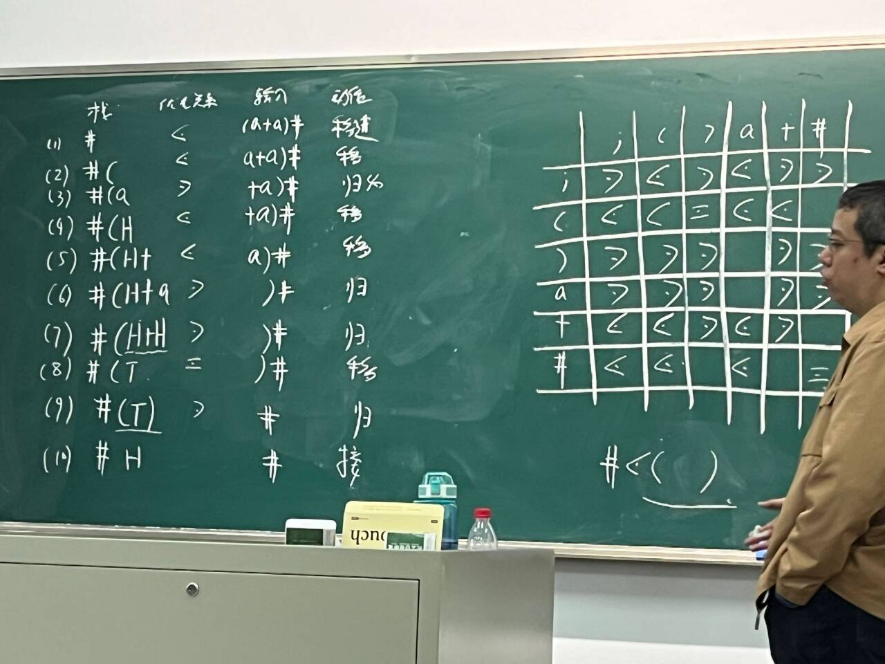

# 编译原理算法
# 第五章 自底向上优先分析
## 简单优先分析法
求出所有符号（$V_N,V_T$）的优先关系（=、<、>），按照这些关系确定**句柄**。规范、准确、效率较低。应用不多。
### 确定优先关系
对于所有符号$V^*$，扫描所有**产生式和生成的短语**:
1. 若有$A → ...XY...$，则$X=Y$。相邻符号相等。
2. 若有$A → ...XB...$，且$B →^+ Y...$，则$X<Y$。即某符号X<后面的非终结符B能推出的所有第一个符号。
3. 若有$A → BD$，且$B →^+ ...X$，$D →^* Y...$，则$X>Y$。即两个相邻的非终结符BD中，B所有推出的**最后一个**符号 > D和D所有推出的**第一个**符号。
- 例子：P105
- 所有句子都有开头和结尾的#。#是一种特殊的括号，有**$\# = \#、\#<V、V>\# $**，其中$V$是所有其他正常符号。表明了#优先级最低。
- 优先关系表
### 分析方法
一个文法是简单优先文法，需要满足：1.优先关系表中每格只有一个优先关系；2.没有空产生式；3.任意两个产生式有不同右部。
    

## 算符优先分析
非规范规约。关键是寻找**最左素短语**，符号栈顶出现最左素短语就进行规约。有局限性，**可能使错误句子通过**，且对句子的要求高，基本只能分析表达式。
### 算符优先文法条件
- 算符文法条件：所有产生式都不存在$A→...BC...$，即**右部不存在任何两非终结符相邻**。
- 算符优先文法：对于每一个非终结符对ab，至多存在一个优先关系。即**优先关系表中每一格只有=,<,>中的一个**
### 优先关系
1. 将$S→#S'#$引入
2. 计算集合：
    - 计算FirstVT集合：$FirstVT(B)=\{b|B→b...或Cb...\}$，即B能推的第一个非终结符$b∪FirstVT(C)$
    - 计算LastVT集合：$LastVT(B)=\{b|B→...b或...bC\}$，即B能推的第一个非终结符$b∪LastVT(C)$
3. 计算关系：
    - 计算=关系：**直接找产生式中有$A→...ab...$或$A→...aCb$**，则$a=b$
    - 计算<关系：找产生式中的**$A→...aB...$**，则$a<FirstVT(B)$
    = 计算>关系：找产生式中的**$A→...Ba...$**，则$LastVT(B)>a$
4. 绘制出优先关系表
### 最左素短语
- 素短语：文法G[S]的句型中，一个短语至少包含一个终结符，且除自身外**不再包含素短语**。
- 最左素短语：句型最左边的素短语。
- 例如：$\#T+T*F+i\#$，短语有$T、T*F、i、T+T*F+i、T+T*F$，则素短语是$T*F$和$i$，最左素短语$T*F$。
- 规约栈中的最左素短语要满足：$N_ia_iN_{i+1}a_{i+1}...N_ja_j$，其中$a_{i-1}<a_i$，$a_i=a_{i+1}=a{i+2}=...=a{j}$，$a_j>a_{j+1}。即最左侧$a_i$的左侧非终结符(#)<$a_i$，最左素短语中的所有$a$全部=，最右侧$a_j$>$a_{j+1}
- **由于算符优先分析方法不关心句柄而只关心最左素短语，所以可能规约成功的句子实际上不是文法的句子**。
### 规约方法
算符优先文法主要是要寻找最左素短语。对于一个#...#的句子，判断能否由文法G(S)规约，则：
1. 从第一个#（自左向右）开始入栈。
2. 如果栈顶符号$a_i$<当前符号$a_{i+1}$，则移进；若栈顶符号$a_i$>当前符号$a_{i+1}，则在栈中寻找最左素短语的头和尾($a_{i-1}<a{i}-a_{j}>a{j+1}$，选取$a_i-a_j$)，用产生式替换。
3. 若中途有非终结符A，则跳过，只判断非终结符。但替换规约时，要根据算符优先文法的性质将非终结符一起规约。
4. 最后，**如果只剩下#B**，即一个左括号#和一个非终结符，则规约成功。否则失败。

### 优先函数
存储优先符号矩阵消耗过多内存，使用优先函数。代价：当某两个符号不能相遇时，优先符号矩阵可以判断出出错，而优先函数中一定有值，**无法发现错误**。
- 构造两个函数$f(x)$、$g(x)$，当$a=b$时$f(x)=g(x)$、$a<b$时$f(x)<g(x)$、$a>b$时$f(x)>g(x)$
- 构造方法：设有$n$个非终结符。
    1. 对于所有终结符$a$，**初始设置$f(a)=g(a)=1$**。
    2. 依次遍历所有大小关系，判断大小：
        1. 若$a>b$，且$f(a) \leq g(b)$，则令$f(a) = g(b) + 1$，强行使得$f(a)>g(b)$
        2. 若$a<b$，且$f(a) \geq g(b)$，则令$g(b) = f(a) + 1$
        3. 若$a=b$，而$f(a) \neq g(b)$，则全部设置为大值。
    3. 重复2直到收敛。**若某个函数值$>2n$，则不存在算符优先函数。**
    - 例子：P119
- 分析：若栈顶a，待输入b。若$f(a)<g(b)$，则移进；$f(a)>g(b)$则规约。

# 第六章 LR分析法
前面的分析算法对文法都有较高的要求。LR分析法是一个**自底向上**分析，是一个移进-规约方法。
## LR分析器
由总控程序、分析表(动作表Action和状态转换表GOTO)、分析栈（文法符号栈：存储、状态栈）组成。